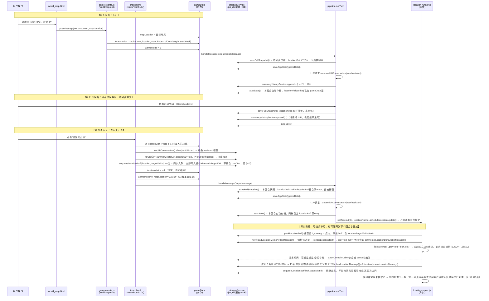

# 地点信息迭代方案（v0.5，§1~§10 已讨论定稿，含 ST 链路隔离性复查修正）

## 1. 背景与目标

### 现状
- `char_card_information/020地点介绍.txt` 经 `tools/generate-prompt-data.js` 编译进 `module/prompt-data-core.js` 的 `PROMPT_CORE_020` 常量，是一份**编译期静态生成的 EJS 模板**，按 `gameData.mapLocation` 分支切换对应地点的介绍正文。
- 运行时由 `module/prompt-builder.js` 的 `_renderLocationIntro(gd)` 取当前地点 key，通过 `promptOverrides.get('LOCATION_'+key, defaults[key])` 读取正文——`promptOverrides` 是**全局配置，存在 `jxz_db` 的 `promptOverrides` key 里，所有存档共用一份，不随存档/快照走**（"提示词管理"弹窗手动编辑用的就是这一层）。
- 结果：无论玩到第几周、剧情如何发展，同一个地点在 prompt 里呈现的介绍永远是同一份静态文本（除非玩家自己手动改「提示词管理」，且改了会影响所有存档）。

### 目标
新增一个用户可开关的 **「地点更新」** 功能：每次角色离开某"下山地点"、返回天山派时，把这次访问期间的剧情摘要喂给一次独立的 LLM 请求，在**保持地点核心设定基本不变**的前提下，重写这个地点的介绍正文；下次角色再去这个地点时，prompt 里看到的就是"记得上次发生了什么"的版本。这份演变结果**属于当前存档自己**，需要正确进快照、进存档、进导出，并和现有的"周总结（L1）/事件总结（L2）"两套异步 Runner 一样处理好和重生成/切存档/新游戏之间的兼容性。

### 定位类比
可以理解成新增一个 **"L-地点" 记忆层**，架构上完全参考已有的两套成熟机制：


| | L1 周总结 | L2 事件总结 | L-地点（本方案） |
|---|---|---|---|
| 触发时机 | `newWeek===1` 提交后 | uiConv 长度滑动窗口 | 从某地点"返回天山派"时 |
| 采集范围 | 本周所有 assistant 楼层 | watermark 之后的窗口 | 本次访问区间（下山→返回）的 assistant 楼层 |
| 队列/去重键 | `summaryBuff` / `targetMarkWeek` | 水位线 `eventWatermark`（无队列，天然可合并） | `locationBuff` / `targetVisitId`（本方案新增） |
| Runner 模块 | `summary-runner.js` | `event-runner.js` | `location-runner.js`（本方案新增） |
| 落地字段 | `weekHistory`（独立 key） | `eventHistory`/`eventMeta`（独立 key） | `locationMemory`（本方案新增，独立 key，架构与前两者保持一致） |
| 是否进 gameData | 否 | 否 | 否（仅 `locationVisit` 这个"访问中"的临时会话标记进 gameData，见 §4.2） |

---

## 2. 现有代码复用点梳理

- `module/prompt-builder.js`：`LOCATION_ORDER`（17个下山地点清单）、`_getLocationDefaults()`（懒加载解析出的默认正文字典）、`_po()`（读取 promptOverrides 覆盖）、`_renderLocationIntro()`（最终渲染入口）。
- `module/prompt-overrides.js` + `storage-service.js` 的 `promptOverrides`：全局手动覆盖层，本方案里降级为"最后一层兜底"，不再是唯一数据源。
- `module/summary-runner.js`：异步 Runner 的标准范式——`_running`互斥锁、`_abortController`、`scheduleXxx()`/`resumeOnLoad()`/`cancel()` 三件套、失败重试、队列去重/轮转。
- `module/event-runner.js`：`resumeOnLoad()` 的 `!launchIntent` 守卫写法（这是这次讨论刚确认修复过的正确模式，本方案从第一天就该照抄，而不是重蹈 `summaryRunner` 最初的覆辙）。
- `module/storage-service.js`：`_SNAPSHOT_KEYS`、`saveFullSnapshot`/`restoreFromSnapshot`、`createSave`/`buildSavePayload`/`importSavePayload` 这几处凡是新增队列/独立 key 都需要照着 `summaryBuff` 的模式补全。

---

## 3. 涉及范围

`LOCATION_ORDER` 里的 17 个"下山地点"：伊州、千佛洞、博斯坦村、博格达峰、哈密绿洲、大沙海、天山派外堡、崆峒派、拜火教总坛、昆仑派、月牙泉、沙州、瓜州、白驼山、迪坎儿村、高昌、龟兹。

天山派本部（`GameMode==0` 分支，含演武场/藏经阁等子场景）不纳入本功能——讨论后确认（见 §8 第7点），这些场景没有清晰的"进入/离开"访问边界，本功能仅限 `GameMode` 变为 1 期间的这 17 个下山地点。

---

## 4. 数据结构设计

### 4.1 `locationMemory`（新增独立 storage key，架构对齐 `weekHistory`/`eventHistory`）

**（v0.4 更新，讨论后确认）** 不再是一整段 `currentText` 字符串，改为**结构化字段**，原因和具体设计见 §10。
```js
// storageService: KEY_LOCATION_MEMORY = 'locationMemory'
// 结构：以地点名为 key 的字典（而非数组），因为每个地点只需要保留"当前生效的一份"，不需要历史版本列表
{
  // key = 地点名，与 LOCATION_ORDER 一致；地点若从未被更新过，则没有这个 key
  '迪坎儿村': {
    危险度: { 评级: '较低', 说明: '……' },
    友善度: { 评级: '高', 说明: '……' },
    行动建议: ['……', '……'],
    子场景: {
      '枯死胡杨': { 介绍: '……', 衰败景象: ['……'], 凄凉氛围: ['……'], 备注: '……' },
      '新井': { 介绍: '……', 备注: '……' }   // AI 可能新增的子场景
    },
    version: 3,            // 已迭代次数，仅用于展示/调试
    lastUpdatedWeek: 12,    // 最近一次更新对应的 markWeek/currentWeek
    lastUpdatedAt: 1731000000000
  }
}
```
未出现在字典里的地点，`_renderLocationIntro` 回退到「promptOverrides 全局覆盖 → 编译期默认正文」这条原有链路，兼容老存档（无需迁移脚本）。

需要补齐的 storage-service.js 配套函数（完全比照 `loadEventMeta`/`saveEventMeta` 那一套的写法）：
`loadLocationMemory()`/`saveLocationMemory(memory)`，均走 `_cache` + `_idbPut` + `_lsSet` 三件套的读写模式。

**为什么不放 gameData，而是单独开一个 storage key？**
和 `weekHistory`/`eventHistory` 是同一类东西——它是"AI 异步生成、随访问次数持续累积/更新的衍生记忆内容"，不是每回合都要读写的核心状态字段（`mapLocation` 这种才算），职责上更适合独立管理：读写粒度更小（更新某个地点时不需要连带整个 gameData 一起走一次 `saveAppState`）、且能完全复用 `weekHistory`/`eventHistory` 已经趟过的那一套"独立 key 如何进快照/存档/导出"的标准做法（见 §6），不需要为 gameData 破例设计新的合并策略。

### 4.2 `gameData.locationVisit`（本次访问会话的临时记录，随 gameData 走）
```js
gameData.locationVisit = {
  active: true,
  location: '哈密绿洲',
  startUiIndex: 42,   // 下山时刻 uiConversation.length，作为采集起点（对齐 markWeekUiIndex 的写法）
  startWeek: 12       // 下山时的 currentWeek，仅用于展示/调试
}
```
- 下山时写入；返回天山派时读取并采集 `uiConversation.slice(startUiIndex)` 内的 assistant 楼层，随后清空（`active:false` 或直接 delete）。
- 因为是 gameData 字段，重生成时的 `restoreFromSnapshot()` 会自动把它和 `mapLocation` 一起整体回滚，不需要额外代码。
- 这个字段之所以仍然放 gameData（而不是也独立开 key），是因为它本质是"当前回合/当前访问进行到哪一步"的运行时状态标记，和 `currentSpecialEvent`/`markWeek` 是同一类东西，不是 AI 异步生成的衍生内容，跟着 gameData 整体走更自然，也不需要单独的持久化函数。

### 4.3 `locationBuff` 队列（新增独立 storage key，完全仿 `summaryBuff`）
```js
// storageService: KEY_LOCATION_BUFF = 'locationBuff'，数组，FIFO
{
  location: '哈密绿洲',
  targetVisitId: 'lv_1731000000000',  // 本次访问的唯一标识（时间戳即可），类比 targetMarkWeek，用于精确 dequeue
  turnCount: 5,
  text: '……（本次访问期间的历史文本，见 §5.2，逐条assistant楼层：有摘要用摘要，没摘要用原文兜底）'
}
```
需要补齐的 storage-service.js 配套函数（全部照抄 `summaryBuff` 那一套）：
`loadLocationBuffQueue`/`enqueueLocationBuff`/`dequeueLocationBuff`/`rotateLocationBuff`/`clearLocationBuff`/`peekLocationBuff`。

**不再包含 `prevText` 字段**（讨论后确认，见 §5.3 变更说明）：地点当前生效正文改为在 `location-runner` **真正处理这条队列时**才实时读取 `storageService.loadLocationMemory()`，而不是在"返回天山派"入队那一刻就固化下来——这是为了正确支持"同一地点连续两次访问、严格按时序处理"的场景（见 §9 第3点）。

**`text` 字段的采集规则**（讨论后确认，见 §9 第1点）：SLG 地点访问期间的每一轮回复都会走 `summaryHistoryService.append(...)`（走 L0 摘要层，不会像"跳过一周"那样进 `weekHistory`），每条摘要记录带 `UIid` 字段指向对应的 `uiConversation` assistant 消息 id。采集时遍历 `uiConversation.slice(startUiIndex)` 里的每一条 assistant 消息：**如果能在 `summaryHistoryService.getAll()` 里找到 `UIid` 命中该消息 id 的摘要条目，就用 `summaryText`；找不到（比如很老的存档、或 `special_event` 来源缺失 `UIid` 的条目）就直接用该消息的原始 `content` 兜底**，逐条拼接成 `text`。这样既能享受摘要带来的 token 节省，又不会因为个别条目缺字段而丢内容。

---

## 5. 触发时机与流程

### 5.0 完整时序图与生命周期（鲁棒性说明）

核心设计原则和"周总结"完全一致：**同步阶段只做"记录/采集/入队"，这几步都是纯本地读写、不等网络，天然会被"当时那一刻"的快照/存档捕获；真正耗时的 LLM 请求全部放到 `setTimeout(0)` 之后的异步阶段，用互斥锁 + 精确 key 防止重复/错配，用 `cancel()`/`resumeOnLoad()` 守卫防止跨存档串台。** 下图按真实时间顺序展示"下山→访问期间若干回合→返回天山派→异步地点更新"整个生命周期：



**为什么这套时序在快照/存档场景下是鲁棒的：**

1. **不会遗漏**——`locationVisit` 的写入（下山）和 `locationBuff` 的入队（返回）都是**纯同步代码**，发生在该回合 `saveFullSnapshot()`/`saveAppState()`/`autoSave()` 之前，因此"这一刻的状态"必然会被该回合的快照和自动存档如实捕获；即使用户在入队后、`location-runner` 完成前就关闭页面，`locationBuff` 已经落在 `jxz_db` 里，下次页面加载时 `resumeOnLoad()`（用 §6 已确认的 `eventRunner` 同款守卫写法）会补跑，不会丢。
2. **不会错配**——`targetVisitId` 用时间戳生成、全局唯一，`dequeueLocationBuff`/写入 `locationMemory` 全部按这个精确 key 操作，不会像"跨存档的 `targetMarkWeek` 可能撞号"那样出现张冠李戴；`prevText` 改为在**真正处理这条队列时**才实时读取 `locationMemory`（不再随 buff 一起固化，见 §4.3/§9 第3点），配合下面第3点的"严格串行、不合并"，保证连续两次访问天然按时序衔接——第二次处理时读到的 `prevText` 就是第一次已经写完的结果。
3. **不会重复**——`location-runner` 用和 `summaryRunner`/`eventRunner` 一致的 `_running` 互斥锁，同一时间只处理一条，`locationBuff` 不做任何合并/去重，严格 FIFO 顺序逐条处理；`locationMemory`/`locationBuff` 都在 `_SNAPSHOT_KEYS` 里，重生成时 `restoreFromSnapshot()` 会把"本回合是否已经入队/是否已经写入新正文"精确回滚到发送前状态，不会出现"重生成后旧结果又写了一遍"或"回滚后队列里凭空多一条"的情况（回滚由 `cancel()` 先中止飞行中的请求来保证，见 §6/§7）。
4. **切存档/新游戏不会串台**——完全复用本次讨论修复过的 `summaryRunner.resumeOnLoad()` 正确模式：`window.onload` 通用位置的 `resumeOnLoad()` 加 `!launchIntent` 守卫，`loadSave` 分支在恢复完**目标存档自己的** `locationMemory`/`locationBuff` 之后再补触发一次；`loadSaveSlot`/`importSave`/`importSTSaveFromLoadModal`/`_confirmRegenerate`/pipeline错误兜底这 5 处都要加 `locationRunner.cancel()`，从设计第一天就避免了"新加载存档的正文被旧会话的迟到结果覆盖"这类问题。

### 5.1 下山（进入地点）—— 触发点已确认
代码位置：[module/game-events.js](module/game-events.js#L973) `setupMessageListeners()` 里的 `worldmap-exit` 分支——用户在世界地图选好地点+随行 NPC 后点"确定"，`world_map.html` 通过 `postMessage({type:'worldmap-exit', mapLocation, ...})` 通知父窗口，父窗口在这里把 `mapLocation` 赋值好之后、`GameMode = 1; await handleMessageOutput(resultMessage);` 发起 LLM 请求之前，就是记录访问起点的正确时机：

**⚠️ ST 链路隔离性修正（复查后确认，之前遗漏）**：`module/game-events.js` 用脚本标签核实过是 **`index.html` 和 `index - SR.html` 共同加载、共同执行的同一份文件**（两个文件都有 `<script src=".../game-events.js">` 且都调用 `setupMessageListeners()`），和 `returnFromSLG()`/`showWorldMap()`（两边各自独立定义一份）完全不同。而 `storageService`/`summaryHistoryService` 只在 `index.html` 里加载，**`index - SR.html` 根本没有这两个模块**——如果不加环境判断，下面这段代码在 ST 链路跑到时会直接报错（`storageService is undefined`）。所以必须包一层 `if (!isInRenderEnvironment())`：

```js
// worldmap-exit 分支内，GameMode = 1 之前
if (!isInRenderEnvironment()) {   // ← 必须加：game-events.js 是 ST/独立前端共享文件，ST 链路没有 storageService
    gameData.locationVisit = {
        active: true,
        location: mapLocation,   // 此时已经是目标地点
        startUiIndex: storageService.loadUIConversation().length,  // 此刻还未 append 本轮消息，对齐 markWeekUiIndex 的写法
        startWeek: currentWeek
    };
}
GameMode = 1;
await handleMessageOutput(resultMessage);
```
`GameMode`/`mapLocation`/`handleMessageOutput` 这几行本来就是两边共用的原有逻辑，不受影响；只有新增的 `locationVisit` 赋值这几行需要包进守卫里。`handleMessageOutput` 内部走 `pipeline.runTurn`，appendUIConversation 发生在其内部、当前同步代码之后，所以此刻取到的 `uiConversation.length` 精确等于"这次下山抵达消息"追加前的下标，和抵达消息本身、以及之后访问期间的所有对话都会被后续 `slice(startUiIndex)` 采集到。

### 5.2 返回天山派 —— 触发点已确认
代码位置：[index.html](index.html#L2952) `returnFromSLG()`——用户点击"返回天山派"按钮的处理函数。函数一开始就用 `_slgLocation`/`_slgCompanions` 保存了重置前的地点信息，这正好是采集本次访问数据的时机，需要在 `GameMode = 0; mapLocation = '天山派';` 重置之前、`await handleMessageOutput(message)` 之前完成：

```js
// returnFromSLG() 内，_slgLocation 已经取好、GameMode 重置之前
if (gameData.locationVisit && gameData.locationVisit.active) {
    var _lv = gameData.locationVisit;
    var _uiConv = storageService.loadUIConversation();
    var _assistantMsgsInRange = _uiConv.slice(_lv.startUiIndex)
        .filter(function(m) { return m.role === 'assistant' && m.id; });
    var _summaryById = {};
    summaryHistoryService.getAll().forEach(function(s) {
        if (s.UIid) _summaryById[s.UIid] = s.summaryText;
    });
    // 逐条楼层：有摘要用摘要，没摘要（缺 UIid，如老存档/special_event）直接用原文兜底
    var _text = _assistantMsgsInRange
        .map(function(m) { return _summaryById[m.id] || m.content; })
        .join('\n');
    storageService.enqueueLocationBuff({
        location: _lv.location,
        targetVisitId: 'lv_' + Date.now(),
        turnCount: _assistantMsgsInRange.length,
        text: _text
        // 不含 prevText：改为在 location-runner 真正处理时才实时读取，见 §5.3
    });
}
gameData.locationVisit = null;
// ……原有的 GameMode = 0 / mapLocation = '天山派' 重置逻辑不变……
await handleMessageOutput(message);
setTimeout(function() { locationRunner.scheduleLocationUpdate(); }, 0);
```
（讨论后确认）不需要"本次访问内容是否为空"的判断分支：只要走到"返回天山派"这一步，`locationVisit.startUiIndex` 到当前之间**至少包含"下山抵达"那一轮的 assistant 回复**（哪怕上一回合刚下山、这一回合立刻返回），`_assistantMsgsInRange` 结构上不可能为空，因此 §8 原问题 6（空内容降级）已确认不需要专门处理。

### 5.3 `location-runner.js`（新模块，架构完全照抄 `summary-runner.js`）
- 状态：`_running` 互斥锁 + `_abortController`
- `scheduleLocationUpdate()`：`peekLocationBuff()` 非空且未 `_running` 才点火——**取到的 buff 对象整体通过参数/闭包传给 `runLocationUpdate(buff)`，全程不再依赖 `gameData.locationVisit`**（那时它已经在 §5.2 里被清空为 `null` 了）。目的地信息的唯一真相来源是 `buff.location`——它是在"返回天山派"那一刻、`enqueueLocationBuff()` 时就已经固化进这条队列记录里的（见 §4.3），和 `summaryRunner.runSummary(buff)` 靠 `buff.targetMarkWeek` 判断写回哪一周是同一个模式：**由谁触发（哪次访问）→ 写回给谁（哪个地点/哪一周），这层映射关系在"入队那一刻"就已经封存进 buff 对象本身，后续任何全局状态的变化（包括 `locationVisit` 被清空、甚至期间又下山去了别的地点）都不会影响这条已入队记录该往哪里写。**
- `resumeOnLoad()`：页面/存档恢复时补跑未完成的队列——**从设计第一天就用 `!launchIntent` 守卫 + 在 `loadSave` 分支恢复完 `locationBuff` 后再补触发**（严格复用这次讨论修好的 `eventRunner` 模式，不重蹈 `summaryRunner` 最初的覆辙）
- `cancel()`：中止飞行中的请求
- 不设触发下限（讨论后确认，§8 原问题 4）：只要有访问记录就入队，不要求"至少 N 轮对话"
- System Prompt：**（v0.4 更新）** 从"重写完整正文"改为"输出结构化 JSON，整体替换 `行动建议`/`子场景`"，完整 schema 和最终 prompt 文案见 §10。
- 成功后（`buff` 是 `runLocationUpdate(buff)` 的参数，`location`/`targetVisitId` 全部取自 `buff`，不读 `gameData`；`prevData`/`prevText` 在处理时才实时取，见下）：
  ```js
  function runLocationUpdate(buff) {
      var location = buff.location;            // 目的地：来自 buff，不是 gameData.locationVisit
      // prevData 实时读取（讨论后确认，§9 第3点）：不合并同地点的多次访问，严格按入队顺序串行处理，
      // 这样后一次访问处理时，locationMemory 里必然已经是前一次访问处理完的最新结果
      var memoryBefore = storageService.loadLocationMemory();
      var prevData = memoryBefore[location]; // 结构化对象，或 undefined（从未更新过）
      // 无论是否更新过，喂给 LLM 的"当前地点介绍正文"都是渲染成文本后的版本（renderLocationText，见 §10），
      // 保持输入格式统一、可读，LLM 只需要在输出时转成结构化 JSON 即可，不需要额外维护一套"编译期默认值的JSON版"
      var prevText = prevData ? renderLocationText(location, prevData) : getPromptLocationDefault(location);
      // ... 调用 LLM，用 prevText + buff.text 组装 prompt，要求严格输出 JSON（见 §10）...
      var parsed = parseLocationJson(rawLlmOutput); // 仿 event-runner._parseEventJson 的容错解析，见 §10
      if (!parsed || !_validateLocationJson(parsed)) {
          throw new Error('地点更新 JSON 解析/校验失败'); // 走 catch，仿 summaryRunner 延迟重试
      }
      var memory = storageService.loadLocationMemory(); // 重新取一次，防止请求耗时期间被其它流程动过（如快照回滚）
      var oldVersion = (memory[location] && memory[location].version) || 0;
      memory[location] = {
          危险度: parsed.危险度,
          友善度: parsed.友善度,
          行动建议: parsed.行动建议,   // 整体替换，讨论后确认
          子场景: parsed.子场景,       // 整体替换，讨论后确认
          version: oldVersion + 1,
          lastUpdatedWeek: currentWeek,
          lastUpdatedAt: Date.now()
      };
      storageService.saveLocationMemory(memory);
      storageService.dequeueLocationBuff(buff.targetVisitId);  // 精确出队，同样来自 buff 自身
  }
  ```
- 失败：**暂不做队列轮转**（讨论后确认，与 `summaryRunner` 的 `rotateSummaryBuff` 不同）——原地按 `summary-runner.js` 同款的延迟重试节奏重试即可，不把失败的这一条挪到队尾。理由：`locationBuff` 本来就不去重/不合并、严格 FIFO，且没有"周"那样必须按顺序推进游戏时间的强约束，一次访问更新失败大概率是临时性网络/API问题，原地重试更简单；如果后续实测出现"某条一直失败、卡住后面其它地点更新"的情况，再补轮转逻辑也不迟。
- **队列处理策略（讨论后确认，§9 第3点）**：同一地点被连续访问两次，`locationBuff` 里会有两条独立记录，**不做任何合并/去重**，严格按入队顺序（FIFO）逐条串行处理——`_running` 互斥锁保证前一条处理完（`saveLocationMemory` 写完）才会开始下一条，因此第二条处理时实时读到的 `prevText` 自然就是第一条已经更新完的结果，衔接关系全靠"严格串行 + 实时读取"这个组合天然成立，不需要额外的合并逻辑。

### 5.4 `prompt-builder.js` 改造
`_renderLocationIntro` 的取值优先级调整为：
1. `renderLocationText(key, storageService.loadLocationMemory()[key])`（存档自身演变值，最高优先级；**v0.4 更新**：`locationMemory[key]` 现在是结构化对象，需要先经 `renderLocationText()` 转换回原文同款的文本格式，见 §10 的渲染函数设计）
2. `promptOverrides.get('LOCATION_'+key, ...)`（全局手动覆盖，次优先级，兼容现有"提示词管理"功能不下线）
3. `_locationDefaults[key]`（编译期默认正文，最终兜底）

**新增导出函数 `window.getPromptLocationDefault(location)`**（讨论后确认，§9 第2点）：`prompt-builder.js` 里已有 `_getLocationDefaults()`（懒加载解析出整个地点字典）和 `window.getPromptLocationDefaults`（复数，导出整个字典，供 `ui/prompt-manager-modal.js` 现有代码使用），但没有"取单个地点默认值"的直接导出。新增 `getPromptLocationDefault(location)`（单数）= `_getLocationDefaults()[location] || ''`，供 §5.3 的 `runLocationUpdate()` 在该地点从未被 AI 更新过时兜底取用。

**`ui/prompt-manager-modal.js` 联动改造**（讨论后确认，§9 第2点）：现有 `_openLocation(sel)`（[ui/prompt-manager-modal.js](ui/prompt-manager-modal.js#L169-L175)）目前固定用 `getPromptLocationDefaults()[name]`（编译期静态默认值）作为 `open()` 的 `fallback` 参数——用户在"提示词管理"弹窗选择某个地点查看/编辑时，看到的永远是没有随剧情演变的旧文本。改造为：
```js
function _openLocation(sel) {
    var name = sel.value;
    if (!name) return;
    var memory = (typeof storageService !== 'undefined' && storageService.loadLocationMemory) ? storageService.loadLocationMemory() : {};
    var latest = (memory[name] && typeof renderLocationText === 'function')
        ? renderLocationText(name, memory[name])   // v0.4更新：结构化对象需先渲染回文本
        : (typeof getPromptLocationDefault === 'function' ? getPromptLocationDefault(name) : '');
    open('LOCATION_' + name, '地点信息 - ' + name, true, latest);
    sel.selectedIndex = 0;
}
```
这样"查看/编辑"打开的 `fallback` 就是"当前最新"（`locationMemory` 里 AI 已更新的版本优先，没更新过的地点退回编译期默认），而 `promptOverrides` 手动覆盖这一层的判断逻辑（`_hasOverrideBadge`/`open()` 内部读取 `promptOverrides.get`）完全不用动——两层互不冲突：`promptOverrides` 是"用户手动改过就用用户的"，`fallback` 是"用户没手动改过时，展示的默认基线该用哪个版本"。

### 5.5 开关：「地点更新」
比照 `gameData.summaryConfig.weekly`/`event`，新增 `gameData.summaryConfig.location = { enabled: true }`（讨论后确认，§8 原问题 5：功能名叫"地点更新"，不叫"地点总结"，避免和周总结/事件总结混淆）。UI 上在"系统设置-总结管理"弹窗里比照现有两行样式加一行"地点更新"开关，关闭时 `location-runner.js` 的 `scheduleLocationUpdate()`/`maybeSchedule()` 一开始就直接 return（触发时机不变，仅加开关判断，和 `summaryConfig.weekly.enabled`/`event.enabled` 的处理方式完全一致）。

---

## 6. 快照 / 存档 / 导出 兼容性设计（重点）

这是本方案里最容易出 bug 的部分，必须对照本次讨论过的三条经验逐一过一遍：

1. **`gameData.locationVisit` 是 gameData 字段**，天然随 `saveAppState`/`saveFullSnapshot`/`restoreFromSnapshot`/`createSave`/`buildSavePayload`/`importSavePayload` 整体读写，**不需要额外代码**，和 `recallConfig`/`summaryConfig` 完全一致。
2. **`locationMemory`（当前生效正文字典）和 `locationBuff`（待处理队列）都是独立 storage key**，必须比照补全下面几处，缺一个就是一个潜在 bug：
   - 都加入 `storage-service.js` 的 `_SNAPSHOT_KEYS`（`eventHistory`/`eventMeta` 已经是这么处理的——不仅队列要能回滚，"已经生效的地点正文"本身也要能被重生成正确回滚，否则重生成会让本轮刚更新的地点描述残留在不该存在的状态里）
   - `saveFullSnapshot()`/`restoreFromSnapshot()` 里补上 `locationMemory`/`locationBuff` 的读写
   - `createSave()`/`buildSavePayload()`/`importSavePayload()` 里补上（比照 `eventHistory`/`eventMeta`/`summaryBuff` 现有写法各加一行）——这三个是 `storage-service.js` 里"生成/导出/导入存档文件本身"用的函数
   - **（复查后新补充，之前遗漏）** `index.html` 里 `loadSaveSlot()`/`importSave()`/`importSTSaveFromLoadModal()` 这三个"切换存档时把数据恢复进当前运行时缓存"的函数，也各自需要显式调用一次恢复逻辑——这三个函数目前对 L2 事件层是单独调用 `storageService.restoreL2FromPayload(payload)` 完成的（不是靠 `importSavePayload()` 内部自动带出来），`locationMemory`/`locationBuff` 需要照抄同一个模式各补一行（例如 `storageService.saveLocationMemory(payload.locationMemory || {})`/`storageService.setLocationBuffQueue(payload.locationBuff || [])`），否则会出现"存档里确实存了，但切换存档那一刻界面/后续更新没吃到"的问题。`importSTSaveFromLoadModal()` 因为源存档是 ST 格式、没有 `locationMemory` 概念，直接清空即可（同 `clearSummaryBuff()` 的处理方式）。
   - `clearEventLayer()` 同级的 `clearLocationLayer()`（新游戏/ST导入时清空 `locationMemory`+`locationBuff`+ gameData 里的 `locationVisit`）
3. **`location-runner.js` 的 `cancel()` 必须接入现有 5 个已知需要"取消飞行中请求"的地方**：`_confirmRegenerate`、`loadSaveSlot`、`importSave`、`importSTSaveFromLoadModal`、`pipeline.js` 的提交阶段错误兜底——每处都在已有的 `summaryRunner.cancel()`/`eventRunner.cancel()` 旁边加一行 `locationRunner.cancel()`。
4. **`location-runner.js` 的 `resumeOnLoad()` 必须直接用"修复后"的正确模式接入 `window.onload`**：通用位置加 `!launchIntent` 守卫，`newGame` 分支不必补调用（`clearLocationLayer()`后队列为空），`loadSave` 分支在恢复完目标存档的 `locationMemory`/`locationBuff` **之后**补触发一次——不允许再出现"用重置前的旧数据抢跑"这个问题。

---

## 7. 与重生成（regenerate）的交互

- **访问期间重生成**（还没返回天山派）：`locationVisit` 是 gameData 字段，`restoreFromSnapshot()` 整体回滚 gameData 时会自动带上，不需要额外处理。
- **刚返回天山派、已入队 `locationBuff`、LLM 尚未返回时重生成**：需要 `locationRunner.cancel()`（见上）阻止旧结果写回；同时 `locationBuff` 队列本身也需要能被快照回滚（见 [§6 第2点] 的 `_SNAPSHOT_KEYS`），否则重生成后会凭空多出一条不该存在的待处理记录。
- **本轮之前已经完成的地点更新**（`locationMemory` 里已经生效的正文）也要能随快照回滚——如果本轮回复期间 `location-runner` 恰好完成了上一次访问的更新并写入了 `locationMemory`，而这次重生成要回退到"发送本轮之前"的状态，`locationMemory` 也应该回到发送前的版本，这也是为什么它要和 `eventHistory`/`eventMeta` 一样进 `_SNAPSHOT_KEYS`，而不能被当作"无所谓回不回滚"的旁路数据。

---

## 8. 讨论结论汇总（原 7 个问题逐条确认）

1. **触发点**：已定位，见 §5.1/§5.2 的具体代码位置（`module/game-events.js` 的 `worldmap-exit` 分支 + `index.html` 的 `returnFromSLG()`）。
2. **长期膨胀担忧**：已消解——单次输入本来就只有"这一次访问"的区间，不会累积历史；`text` 改用 `summaryHistory` 摘要（§4.3）进一步降低单次输入的 token 成本。
3. **输出格式**：确认采用"整体重写/替换"而非增量 patch；**v0.4 更新**：进一步细化为"结构化 JSON 整体替换"而非自由行文，具体 schema 和理由见 §10。
4. **触发下限**：确认不设门槛，有访问就入队。
5. **开关**：确认加，命名为「地点更新」（`gameData.summaryConfig.location`），不叫"地点总结"，见 §5.5。
6. **空内容降级**：确认不需要——结构上至少包含"下山抵达"这一轮内容，不存在真正的空访问。
7. **天山派子场景**：确认不做，本功能仅限 `GameMode` 变为 1 期间的 17 个下山地点（`LOCATION_ORDER`），天山派本部本身没有独立的"进入/离开"边界，不纳入这套机制。

## 9. 实现细节讨论结论（原 §8 讨论时新引出的 3 个问题，已全部确认）

1. **`summaryHistory` 条目缺失 `UIid` 的兼容性**：确认——对于没有 `UIid` 关联到原文的楼层（老存档、`special_event` 来源等），直接用该楼层的原始 `content` 兜底，不再尝试按 `week` 粗筛或允许空文本。已更新到 §4.3/§5.2：逐条 assistant 楼层判断"有摘要用摘要，没摘要用原文"，混合拼接成 `text`。
2. **地点默认正文的单条读取接口**：确认新增 `window.getPromptLocationDefault(location)`（单数，见 §5.4），并同步改造 `ui/prompt-manager-modal.js` 的 `_openLocation()`——"提示词管理"弹窗里查看/编辑某个地点时，展示的 `fallback` 从固定的编译期默认值，改为"`locationMemory` 里的当前最新版本，没有才退回编译期默认"，与 prompt 渲染优先级保持一致的用户体验。
3. **同一地点连续两次访问的处理策略**：确认**不合并、不去重**，`locationBuff` 按入队顺序严格 FIFO 串行处理（`_running` 互斥锁保证一次只处理一条）。相应地，`prevText` 不再在"返回天山派"入队时固化（已从 §4.3 的 buff 结构里去掉这个字段），改为在 `location-runner` **真正处理这条记录时**才实时 `loadLocationMemory()` 现取（见 §5.3）——这样后一次访问被处理时，天然读到的就是前一次访问已经更新完的最新正文，严格符合时序因果，且不需要任何额外的合并/去重代码。

---

## 10. 结构化字段 + 危险度/友善度/行动建议联动方案（v0.4 新增）

### 10.0 背景：现状是三份互相独立、从未联动的硬编码数据

排查代码后确认，"危险度/友善度/行动建议"目前分散在三个完全独立、彼此从不同步的地方：

1. `char_card_information/020地点介绍.txt`（编译进 `PROMPT_CORE_020`）——纯文本，仅供 LLM 阅读，代码不解析。
2. `module/game-config.js` 的 `locationDangerLevels`（地点→危险度等级字符串）——只用于 [index.html#L2789](index.html#L2789) 和 `index - SR.html` **各自独立**的 `sendFreeAction()` 里查 `dangerEventChance[level]` 算随机/战斗事件触发概率。
3. `world_map.html` 自己的 `locationDangerInfo`（[world_map.html#L688](world_map.html#L688)，含 `danger:{level,desc}`、`friendly:{level,desc}`、`advice:[...]`）——只用于世界地图弹窗展示。

这三份数据从未被代码绑定过，一直是维护者手动保证语义一致。这次要做的，就是让 AI 更新的结果**真正联动**到 2、3 两处（1 保持不变，作为"从未更新过时的默认值来源"）。

**ST 链路（`index - SR.html`）隔离性确认（v0.5 复查修正）**：
- 全局搜索 `promptBuilder`，确认它**只被 `module/pipeline.js`（独立前端）调用**，`index - SR.html` 完全不引用这个文件——ST 链路走自己的 EJS 渲染，直接读原始 `PROMPT_CORE_020` 常量，不经过 `_renderLocationIntro`。
- `locationDangerLevels[mapLocation]` 这段概率判定代码在 `index.html`（第2789行附近）和 `index - SR.html`（第2101行附近）是**两份完全独立、各自维护的代码**，不是共享模块。
- `showWorldMap()`/`returnFromSLG()` 同理，在两个文件里也是**各自独立定义**（`index - SR.html#L3243`/`#L2348`）。
- `ui/prompt-manager-modal.js`/`module/storage-service.js`/`module/summary-runner.js`/`module/event-runner.js` 用脚本标签搜索确认 `index - SR.html` **完全没有加载**这几个文件。
- **⚠️ 唯一的例外，也是复查时发现的真实风险点**：`module/game-events.js`**是两个文件共同加载、共同执行的同一份文件**（`index - SR.html` 也有 `<script src=".../game-events.js">` 且也调用 `setupMessageListeners()`），§5.1 打算插入代码的 `worldmap-exit` 分支正好在这个共享文件里。由于 `storageService` 没有被 `index - SR.html` 加载，如果不加环境判断，这段代码在 ST 链路里会直接报错。**已在 §5.1 里补上 `if (!isInRenderEnvironment())` 守卫**，加了这道守卫之后才能保证真正的零影响。
- **结论**：只要 §5.1 的守卫按上述方式实现，本方案改动的所有文件（`index.html`/`prompt-builder.js`/`storage-service.js`/`world_map.html`/`game-events.js`）对 ST 链路（`index - SR.html`）都不会有任何影响；同时不碰 `020地点介绍.txt`/`generate-prompt-data.js`/`prompt-data-core.js` 这几个编译期默认值源头。

### 10.1 `locationMemory` 结构化 schema（讨论后确认）

字段设计直接对齐 `world_map.html` 的 `locationDangerInfo` 结构（中文字段名，语义一一对应）：

```js
{
  危险度: { 评级: '较低', 说明: '……' },       // 对应 world_map.html 的 danger:{level,desc}
  友善度: { 评级: '高',   说明: '……' },       // 对应 world_map.html 的 friendly:{level,desc}
  行动建议: ['……', '……'],                    // 对应 world_map.html 的 advice:[...]
  子场景: {                                   // 对应 020地点介绍.txt 里"子场景"下的内容
    '枯死胡杨': { 介绍: '……', 衰败景象: ['……'], 凄凉氛围: ['……'], 备注: '……' },
    '新井': { 介绍: '……', 备注: '……' }
  }
}
```
`子场景` 内部允许"字符串"（如 `介绍`/`备注`）或"字符串数组"（如各种列表小标题）两种值类型，覆盖现有 17 个地点草稿文件里出现过的所有写法。

**整体替换策略（讨论后确认）**：`行动建议` 和 `子场景` 每次更新都由 LLM **整体重新输出**、直接覆盖旧值，不做增量 patch/合并——实现简单、校验简单（某个字段格式不对就整条弃用保留旧值），代价是 LLM 每次要把没变化的部分也完整复述一遍，但换来更高的可靠性，符合之前"重生成/切存档场景优先选简单可靠方案"的一贯取舍。

### 10.2 LLM 输出改为严格 JSON

**System Prompt（v0.4 版，取代此前"重写完整正文"的自由行文版本）**：

```js
var LOCATION_SYSTEM_PROMPT = [
    '你是游戏"瀚海归义录"的地点记录官。你会拿到【当前地点信息】（含结构化的危险度/友善度/行动建议 + 各子场景描述）和【本次访问期间发生的剧情摘要】，任务是输出一个更新后的完整地点信息 JSON。',
    '',
    '【一、输出格式（最重要，严格遵守）】',
    '只输出一个合法 JSON 对象，不要 markdown 代码围栏，不要任何解释文字。结构必须是：',
    '{',
    '  "危险度": { "评级": "低|较低|中|较高|高", "说明": "string" },',
    '  "友善度": { "评级": "低|较低|中|较高|高", "说明": "string" },',
    '  "行动建议": ["string", "..."],',
    '  "子场景": {',
    '    "子场景名": { "介绍": "string", "备注": "string", "任意其它标题": ["string", "..."] },',
    '    "...": { "..." }',
    '  }',
    '}',
    '"危险度"/"友善度"的"评级"必须严格是"低/较低/中/较高/高"这五档之一，不得自造新档位。',
    '字符串值内部禁止出现英文双引号 ""，会破坏 JSON 结构；需要引用称呼、地名、物件名等场合一律使用「」书名号代替，不得使用 ""。',
    '',
    '【二、格式规则：结构化字段与结构层级】',
    '除非剧情明确导致某个子场景被彻底摧毁、不复存在，否则不要删除已有的子场景条目，也不要改变其内部字段名称（"介绍""备注"等标题原样保留）；已有子场景的描述可以在原基础上追加/微调，但不要整段替换或改变行文风格。"行动建议"和整个"子场景"字典都是整体替换——你需要把没有变化的条目也原样输出一遍，而不是只输出变化的部分。',
    '',
    '【三、核心原则：只写地点本身的状态变化，不写主角的行为】',
    '本次访问的剧情摘要只是判断依据，最终写出来的每一句话都必须是"这个地方现在是什么样子"，不能是"发生了什么事"。凡是带有主谓宾、能看出"谁对谁做了什么"的句子都不合格。',
    '- 判断标准：句子里不能出现"{{user}}""主角""大侠"等称呼，也不能出现"来到/前来/帮助/打了/击退/离开"这类描述访客行为的动词。',
    '- 合格写法：主角在村里打了一口井 → 在"子场景"里新增"新井"条目（或在最相关的现有子场景里追加一句），客观描述井的位置、水质、村民如何取用，不提「是谁挖的」。',
    '- 合格写法：主角帮当地剿灭了马匪 → 在相关子场景"备注"里补一句"近来匪患已平息，商队渐多"，不写「马匪被剿灭」这件事的经过。',
    '- 禁止写法："{{user}}来到迪坎儿村，帮村民打了一口井，村民感激不尽"（这是叙事，不是设定更新）。',
    '- 禁止写法：任何带有时间顺序、因果连接词描述"发生了什么事"的句子——只保留事情沉淀下来的最终状态。',
    '',
    '【四、篇幅与改动幅度】',
    '- 更新后总篇幅应与原文大致相当（浮动控制在 ±20% 以内），不要大幅扩写或大幅删减',
    '- 允许追加新的子场景条目，允许修改/更新现有设定（包括"危险度""友善度"的评级和说明文字），但改动要克制、循序渐进，符合"逐步演变"而非"一次性推翻重写"',
    '- 剧情不足以支撑一个全新子场景时，优先在最相关的现有子场景里追加一两句，不要为了体现变化硬造新条目'
].join('\n');
```

user prompt 组装方式不变：`【当前地点信息】\n` + `prevText`（见 §10.3）+ `\n\n【本次访问期间发生的剧情摘要】\n` + `buff.text`。

### 10.3 解析、校验与渲染

- **`parseLocationJson(raw)`**：仿 `event-runner.js` 的 `_parseEventJson`——去 `` ```json `` 围栏 → 直接 `JSON.parse` → 失败则取首尾 `{`/`}` 之间的切片再解析 → 失败则做中文引号修复后再试一次。全部失败则视为本次请求失败，走 `location-runner` 的原地延迟重试（§5.3）。
- **`_validateLocationJson(parsed)`**：防御性校验——`危险度.评级`/`友善度.评级` 必须在五档枚举里，不在就整条 `危险度`/`友善度` 弃用、保留旧值（不影响其它字段）；`行动建议` 必须是字符串数组，`子场景` 必须是对象且每个 value 也是对象；只要 JSON 本身解析成功但个别字段形状不对，做**字段级别**的兜底（保留旧值），只有整体 JSON 解析失败才视为这次更新失败。
- **`renderLocationText(location, data)`**（新增函数，`prompt-builder.js` 里定义）：把结构化 `data` 渲染回和 `020地点介绍.txt` 同款缩进格式的文本（`地点名:\n  概览:\n    危险度:\n      评级: ...\n      说明: ...\n    友善度:\n      ...\n    行动建议:\n      - ...\n  子场景:\n    子场景名:\n      介绍: ...\n      备注: ...`），供两处使用：
  1. `_renderLocationIntro`（§5.4）注入最终 prompt；
  2. `location-runner.js` 组装"当前地点信息"喂给下一次 LLM 请求时用（§5.3 的 `prevText`）。
  这样**不需要给 17 个地点手工再写一份 JSON 格式的默认值**——地点从未被更新过时，直接用 `getPromptLocationDefault(location)` 取原始编译期文本喂给 LLM（LLM 有能力"阅读"这段自由行文并在输出时结构化成 JSON）；一旦更新过一次，后续都走"结构化对象 → `renderLocationText` 渲染成文本 → 喂给 LLM"这条统一路径。

### 10.4 联动同步点 1：事件触发概率（仅改 `index.html`）

[index.html#L2789](index.html#L2789) 原代码：
```js
const dangerLevel = locationDangerLevels[mapLocation] || '低';
```
改为（**仅此文件**，`index - SR.html` 对应那一行原样不动）：
```js
const _locMem = (typeof storageService !== 'undefined' && storageService.loadLocationMemory) ? storageService.loadLocationMemory() : {};
const dangerLevel = (_locMem[mapLocation] && _locMem[mapLocation].危险度 && _locMem[mapLocation].危险度.评级)
    || locationDangerLevels[mapLocation] || '低';
```

### 10.5 联动同步点 2：世界地图展示（`index.html` 传参 + `world_map.html` 接收覆盖）

`index.html` 的 `showWorldMap()`（[index.html#L4491](index.html#L4491)）在拼 URL 参数时，新增一个 `locationOverrides` 参数——把 `locationMemory` 里所有已更新地点的 危险度/友善度/行动建议，转换成 `world_map.html` 原有的英文字段名结构后传过去：
```js
const _locMem = storageService.loadLocationMemory();
const _overrides = {};
Object.keys(_locMem).forEach(function(loc) {
    var d = _locMem[loc];
    _overrides[loc] = {
        danger: d.危险度,      // { 评级, 说明 } → { level: 评级, desc: 说明 } 需要做一次 key 映射
        friendly: d.友善度,
        advice: d.行动建议
    };
});
params.set('locationOverrides', JSON.stringify(_overrides));
```
（注意：`危险度.评级/说明` 与 `world_map.html` 的 `danger.level/desc` 字段名不同，实际实现时要做一次映射转换，上面伪代码简化表示）

`world_map.html` 收到 `locationOverrides` 参数后，在渲染前对 `locationDangerInfo` 做一次浅合并（只覆盖有数据的地点，其它地点保持硬编码不变）：
```js
const urlParams = new URLSearchParams(location.search);
const overridesRaw = urlParams.get('locationOverrides');
if (overridesRaw) {
    try {
        const overrides = JSON.parse(overridesRaw);
        Object.keys(overrides).forEach(function(loc) {
            if (locationDangerInfo[loc]) {
                Object.assign(locationDangerInfo[loc], overrides[loc]);
            }
        });
    } catch (e) { /* 解析失败静默忽略，保留硬编码默认值 */ }
}
```
`index - SR.html` 的 `showWorldMap()` **不做任何修改**，不会传 `locationOverrides` 参数，`world_map.html` 收不到参数时这段逻辑直接跳过，行为和现在完全一样——两条链路天然隔离，不需要额外的环境判断。

### 10.6 本节新增/改动文件汇总

- `module/prompt-builder.js`：新增 `renderLocationText(location, data)`；`_renderLocationIntro` 改用它；`_parseLocationDefaults`/`getPromptLocationDefault` 不变。
- `module/location-runner.js`（新模块）：新增 `parseLocationJson`/`_validateLocationJson`，system prompt 换成 §10.2 的结构化版本，`runLocationUpdate` 按 §5.3 更新后的伪代码实现。
- `module/game-events.js`：`worldmap-exit` 分支新增 `locationVisit` 写入，**必须包 `if (!isInRenderEnvironment())` 守卫**（见 §5.1 的 v0.5 修正，这是唯一一处共享文件改动，其余改动都在各自独立的文件里）。
- `index.html`：`sendFreeAction()` 的危险度取值逻辑（§10.4）+ `showWorldMap()` 新增 `locationOverrides` 参数（§10.5）+ `returnFromSLG()`（§5.2）+ `loadSaveSlot()`/`importSave()`/`importSTSaveFromLoadModal()` 恢复 `locationMemory`/`locationBuff`（§6 第2点新补充）+ 5 处 `cancel()` + `window.onload` 的 `resumeOnLoad()` 接入，均只改这一个文件。
- `world_map.html`：新增接收并合并 `locationOverrides` 参数的逻辑（§10.5）。
- `index - SR.html`：**不做任何修改**。

---

以上方案 §1~§10 已讨论确认，可以按此进入具体实现（预计新增 `module/location-runner.js`，改动 `storage-service.js`、`prompt-builder.js`（`_renderLocationIntro` 优先级 + 新增 `getPromptLocationDefault`/`renderLocationText`）、`ui/prompt-manager-modal.js`（`_openLocation` 展示最新版本）、`game-config.js`（`defaultGameData.summaryConfig.location` 新增字段）、`index.html`（§5.1/§5.2 两处触发点 + `loadSaveSlot`/`importSave`/`importSTSaveFromLoadModal` 恢复逻辑 + 5 处 cancel + window.onload 的 resumeOnLoad 接入 + §10.6 两处联动同步）、`module/game-events.js`（§5.1 触发点，需带 `isInRenderEnvironment()` 守卫）、`world_map.html`（接收 `locationOverrides` 参数覆盖展示）；`index - SR.html` 全程不改动）。
